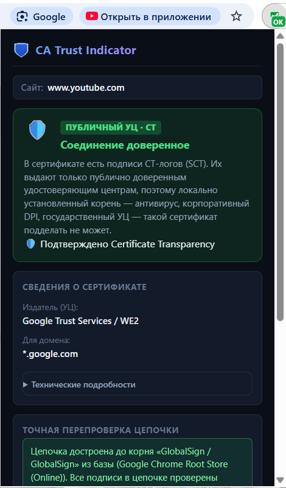
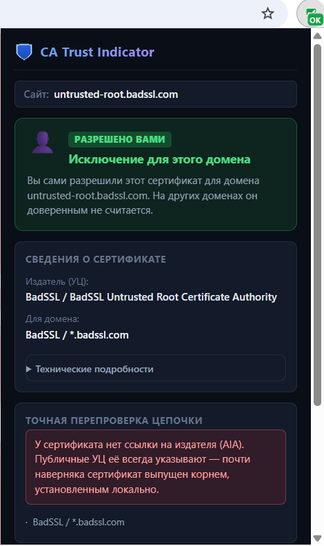
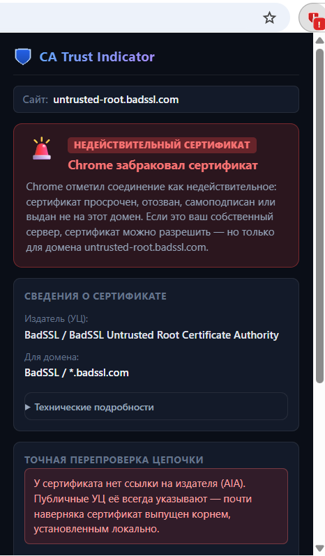

# CA Indicator

Расширение для Chrome, которое показывает, **кто на самом деле подписал сертификат сайта**:
публичный удостоверяющий центр — или корень, установленный на вашем компьютере.

Ничего не блокирует и никуда не лезет: всеми сайтами вы пользуетесь как раньше, просто видите,
чем именно защищён каждый из них.

---

## Как это выглядит

| Публичный УЦ | Разрешено вами | Недействительный сертификат |
|---|---|---|
|  |  |  |
| Есть подписи CT, цепочка достроена до корня из Chrome Root Store | Ваш сервер: доверие выдано вручную и действует только на этом домене | Просрочен, самоподписан или выдан не на этот домен |

---

## Зачем это нужно

Замок в адресной строке означает только одно: соединение зашифровано, и браузер доверяет тому,
кто выдал сертификат. Он **не** означает, что вас никто не читает.

Достаточно один раз установить в систему чужой корневой сертификат — и браузер начнёт молча
доверять всему, что этим корнем подписано. Владелец корня может выпустить сертификат на любой
домен: на банк, на почту, на мессенджер. Трафик расшифровывается на промежуточном узле,
читается и шифруется заново. Замок остаётся на месте, предупреждений нет, отличить подмену
глазами невозможно.

Так работают:

- **удостоверяющие центры государства или провайдера** — их предлагают установить, чтобы
  «открывались нужные сайты»;
- **антивирусы** с проверкой HTTPS — Kaspersky, ESET, Avast, Dr.Web и другие ставят свой корень,
  чтобы просматривать зашифрованный трафик;
- **корпоративные DPI-шлюзы** — Zscaler, Fortinet, Palo Alto и им подобные;
- **отладочные прокси** — mitmproxy, Fiddler, Burp Suite.

Часть этих случаев вы разрешили сами и они безобидны. Проблема в том, что браузер не показывает
разницы между ними и тем, чего вы не разрешали. CA Indicator показывает.

### Корень мог появиться без вашего ведома

Чужой корневой сертификат не обязательно ставили осознанно. Типичные пути:

- **вы согласились по ошибке** — инструкция в интернете обещала, что «всё заработает», а системное
  окно с предупреждением легко нажать не глядя;
- **корень установила программа** — менеджер загрузок, «ускоритель интернета», VPN-клиент,
  бесплатный антивирус, рекламное ПО. Многие делают это молча, упомянув строчку где-то в
  лицензионном соглашении;
- **сертификат добавил кто-то другой с доступом к компьютеру** — родственник, коллега, мастер из
  сервиса, прежний владелец ноутбука.

Итог во всех случаях одинаковый: у кого-то появляется техническая возможность читать весь ваш
трафик — логины, пароли, переписку, содержимое страниц интернет-банка, — а браузер продолжает
показывать замок и молчать. Расширение показывает, что это происходит, даже если вы понятия не
имеете, когда и откуда взялся этот корень.

### Рабочий компьютер — отдельный разговор

На технике работодателя корневой сертификат компании стоит почти всегда: через корпоративный шлюз
идёт весь трафик, и иначе он его не увидит. Это законная и распространённая практика, обычно
описанная в политике безопасности, и для рабочих задач в ней нет ничего страшного.

Важно другое: такой сертификат расшифровывает **весь** трафик браузера, а не только рабочий. Личная
почта, соцсети, маркетплейс и интернет-банк, открытые в обеденный перерыв, идут через тот же шлюз
и точно так же могут быть расшифрованы, записаны и просмотрены. Это не обязательно чьё-то злое
намерение — часто просто побочный эффект настроек, — но личный пароль от этого не перестаёт быть
видимым.

Прежде чем вводить свои личные пароли на рабочем ноутбуке, полезно знать, что происходит именно
с этим сайтом прямо сейчас. Расширение отвечает на этот вопрос одним взглядом на значок.

### Расширение ничего не блокирует

Это индикатор, а не блокировщик и не файрвол. Оно не разрывает соединения, не закрывает доступ к
сайтам, не меняет содержимое страниц и ничего не запрещает. Всеми сайтами вы продолжаете
пользоваться ровно как раньше.

Единственное, что оно делает, — подсвечивает разницу: какие сайты зашифрованы сертификатом
**глобально доверенного** удостоверяющего центра, а какие — только **локальным корневым
сертификатом** с этого компьютера, который мог попасть туда как угодно и принадлежать кому угодно.
Что делать с этим знанием — решаете вы: где-то достаточно просто не вводить личный пароль, а
где-то стоит разобраться, откуда взялся корень.

---

## Как он это определяет

Никаких списков «плохих» и «хороших» центров. Списки имён — плохой способ: любой центр, которого
нет в списке, ошибочно объявляется подозрительным, а имя в сертификате можно написать какое угодно.

Вместо этого используется **Certificate Transparency**.

Каждый сертификат от публичного УЦ обязан нести встроенные подписи CT-логов — SCT. Эти подписи
выдают публичные журналы, и попадают в них только сертификаты публично доверенных центров.
Локально установленный корень такие подписи получить не может: журналы его не примут.

При этом Chrome требует соблюдения Certificate Transparency **только** для цепочек к публичным
корням. Цепочки к корню, установленному на вашей машине, от этого требования освобождены — это и
есть та самая лазейка, благодаря которой перехват вообще работает. CA Indicator смотрит именно в
неё:

| Что в сертификате | Вердикт |
|---|---|
| Подписи CT есть | 🛡️ зелёный — сертификат публичного УЦ |
| Подписей CT нет | ⚠️ жёлтый — подписан локально установленным корнем |
| Издатель в вашем белом списке | 🛡️ зелёный — вы разрешили это сами |
| Страница по HTTP | 🔓 красный — шифрования нет вообще |

Жёлтый — это подозрение, а не приговор. Точный ответ даёт перепроверка.

---

## Точная перепроверка цепочки

Chrome отдаёт расширению **только сертификат самого сайта** — ни промежуточных центров, ни корня.
Поэтому при открытии расширения запускается достройка цепочки своими силами:

1. в сертификате берётся ссылка на издателя (расширение Authority Information Access);
2. сертификат издателя скачивается;
3. подпись потомка проверяется открытым ключом издателя через WebCrypto;
4. шаг повторяется, пока цепочка не упрётся в корень из встроенной базы
   (Chrome Root Store + Mozilla NSS, 145 корней).

Если все подписи сошлись и цепочка привела к известному корню — сертификат настоящий.
Если у сертификата вообще нет ссылки на издателя, это сам по себе сильный признак локального корня:
публичные УЦ такую ссылку указывают всегда.

Поддержаны RSASSA-PKCS1-v1_5 и ECDSA (P-256/384/521). Разобраны неудобные случаи: контейнеры
PKCS#7 вместо голого сертификата (Sectigo) и промежуточные центры, не публикующие ссылку на свой
корень (GlobalSign) — для них корень ищется в базе по точному совпадению DER-байтов имени.

---

## Чего расширение не умеет

Честный список ограничений — он важнее списка возможностей.

- **Проверяется наличие подписей CT, а не их корректность.** Полная проверка требует открытых
  ключей CT-логов и реконструкции precertificate. Подделка, скопировавшая расширение SCT из
  настоящего сертификата, мгновенную проверку пройдёт — но развалится на перепроверке цепочки.
- **Внутренние корпоративные сертификаты будут жёлтыми.** У них нет и не может быть CT. Для них
  предусмотрен белый список: добавьте издателя один раз, и он перестанет беспокоить.
- **Редкий ложный жёлтый.** Подписи CT можно доставлять не внутри сертификата, а через расширение
  TLS или OCSP stapling. Такие сертификаты встречаются нечасто, но расширение их не увидит.
- **Не работает без флага Chrome.** См. установку ниже.
- **Не работает на `chromewebstore.google.com`** — Chrome полностью запрещает там расширения.
  Это ограничение браузера, а не признак угрозы.

---

## Установка

Требуется **Chrome 144 или новее**.

1. Скачайте код: кнопка **Code → Download ZIP** — и распакуйте архив.
   Или, если пользуетесь git: `git clone <адрес этого репозитория>`.
2. Откройте `chrome://extensions`, включите **Режим разработчика**, нажмите
   **Загрузить распакованное расширение** и выберите распакованную папку.
3. Включите флаг доступа к сертификатам — без него расширение не получит от браузера никаких
   данных:
   - откройте `chrome://flags/#web-request-security-info`;
   - переключите в **Enabled**;
   - **полностью перезапустите** Chrome.

Можно вместо флага запустить браузер с ключом `--enable-features=WebRequestSecurityInfo` —
для этого есть `start-chrome-with-flag.cmd`.

Если флаг выключен, расширение само об этом скажет и предложит открыть нужную страницу.

---

## Приватность

Пассивная проверка полностью офлайн: расширение читает сертификат, который браузер и так получил,
и никуда ничего не отправляет.

Сеть используется ровно в двух случаях, оба — по вашему действию:

- **перепроверка цепочки** при открытии расширения — запросы к серверам удостоверяющих центров за
  сертификатами издателей. Адрес такого запроса указывает на удостоверяющий центр, а не на сайт:
  у `letsencrypt.org` и `wikipedia.org` он буквально совпадает — `http://ye2.i.lencr.org/`.
  Скачанные сертификаты кэшируются, поэтому повторные открытия обходятся без запросов;
- **обновление базы корней** — кнопка в настройках и еженедельное обновление из официального
  Chrome Root Store.

Ни телеметрии, ни аналитики, ни проверок репутации. Ни один адрес посещённой страницы никуда не
уходит.

---

## Что показывает интерфейс

**Значок на панели** — цвет вердикта: зелёный щит с галочкой, жёлтый вопрос, красный
восклицательный знак, красный перечёркнутый щит для HTTP.

**Плашка на странице** — появляется при проблеме и гаснет сама. Поведение настраивается: только при
угрозах, всегда или никогда.

**Окно расширения** — вердикт, издатель, домен, свёрнутые технические подробности с отпечатком
SHA-256, результат перепроверки цепочки и кнопка **«Скопировать отчёт»**: весь разбор одним
текстом, чтобы переслать или показать специалисту.

Текст в окне выделяется и копируется.

---

## Почему не в Chrome Web Store

Расширение не заработает, пока в браузере не включён флаг
`chrome://flags/#web-request-security-info` — без него Chrome просто не отдаёт данные
сертификата. Установка из магазина в один клик создавала бы ложное впечатление, что всё готово,
тогда как расширение молчало бы до перезапуска браузера с флагом.

Поэтому распространение идёт исходниками: вы видите весь код, который запускаете, и ставите его
осознанно. Для инструмента, который сам занимается доверием, это выглядит честнее.

---

## Лицензия

[MIT](LICENSE) — пользуйтесь, изменяйте и распространяйте свободно, в том числе в коммерческих
проектах. Единственное условие — сохранить упоминание авторства.

Расширение бесплатное. Ни рекламы, ни платных функций, ни сбора данных.

---

## Разработка

Ни зависимостей, ни сборки — файлы загружаются в Chrome как есть.

```
node test_extension.js     # манифест, иконки, разбор ASN.1, проверка SCT
node test_aia_chain.js     # достройка цепочки и проверка подписей (нужна сеть)
node build_root_store.js   # пересобрать trusted_roots.json
node generate_icons.js     # перерисовать иконки
node build_store_zip.js    # собрать ZIP для Chrome Web Store в dist/
node bump_version.js 1.7.3 # поднять версию в манифесте и футере попапа
```

Подробности архитектуры и подводные камни — в [CLAUDE.md](CLAUDE.md).
